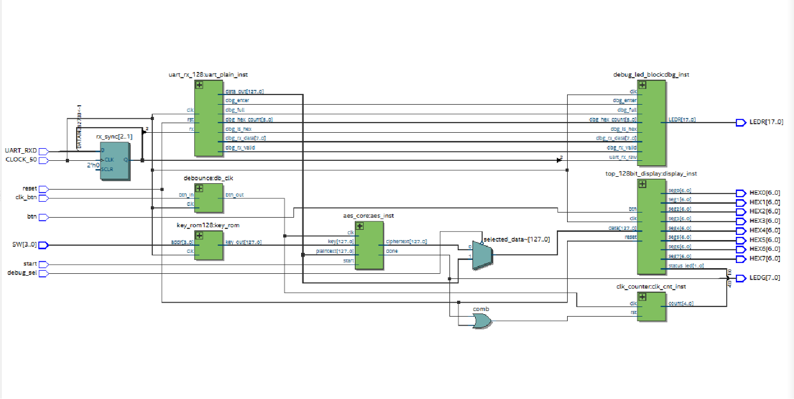

# AES-128 Encryption Accelerator with UART Input — DE2-115 FPGA

An iterative, FSM-based AES-128 encryption accelerator on the Altera DE2-115 (Cyclone IV E), with UART plaintext entry, switch-selectable key ROM, and round-by-round manual clocking so every AES round can be observed live on hardware.

    

> 🎬 *Demo video/GIF placeholder — to be added*

## Quick Start

1. Clone this repository and open `quartus/top.qpf` in Quartus Prime 22.1.
2. Program `quartus/output_files/top.sof` onto the DE2-115 via USB-Blaster.
3. Open a 9600 8N1 serial terminal, type 32 hex chars + Enter, flip SW5, press SW17 eleven times, read the ciphertext on HEX7..HEX0.

Full walkthrough: [docs/06_how_to_use.md](docs/06_how_to_use.md)

## System Block Diagram




## Features

- Full AES-128 (NIST FIPS 197) encryption, verified on hardware
- Iterative architecture: one shared combinational round reused 11 times (6% of the FPGA)
- Manual round clocking — one button press = one AES round, visible on LEDs
- UART plaintext input (9600 8N1) with 2-FF synchronizer and live debug LEDs
- 16 switch-selectable keys from an on-chip ROM
- 128-bit result scrolled over the eight 7-segment displays
- Fully combinational key schedule — all 11 round keys with zero latency

## Hardware Requirements

- Terasic DE2-115 board (Cyclone IV E EP4CE115F29C7)
- USB-Blaster cable (programming) + RS-232/USB-UART cable (plaintext input)
- Intel Quartus Prime 22.1 std to recompile (optional — a .sof suffices to run)

## Project Structure

```
├── README.md / CONTRIBUTORS.md / .gitignore
├── src/
│   ├── top.v                — master integrator
│   ├── aes/                 — aes_core, aes_fsm, aes_datapath, aes_keyschedule,
│   │                          aes_subbytes, aes_sbox, aes_shiftrows,
│   │                          aes_mixcolumns, key_rom128
│   ├── uart/                — uart_rx, uart_rx_128
│   ├── display/             — top_128bit_display, eight_sevenseg_32bit, hex_to_7seg
│   ├── debug/               — debug_led_block, clk_counter
│   └── utils/               — debounce, edge_detector, counter2_up, mux4x1_32bit
├── quartus/                 — top.qpf, top.qsf (pin assignments), key.txt
├── data/                    — key.txt, data.txt, expected.txt (verified ciphertexts)
├── docs/                    — documentation (below) + images/
└── sim/                     — testbenches
```

## Documentation

1. [System Architecture](docs/01_architecture.md)
2. [AES Core](docs/02_aes_core.md)
3. [UART Input](docs/03_uart_input.md)
4. [Display System](docs/04_display_system.md)
5. [Pin Assignments](docs/05_pin_assignments.md)
6. [How to Use](docs/06_how_to_use.md)
7. [Test Vectors](docs/07_test_vectors.md)
8. [Results & Analysis](docs/08_results_and_analysis.md)

## Test Vectors (abbreviated)

| SW[3:0] | Plaintext | Key | Ciphertext |
|---------|-----------|-----|------------|
| 0000 | 00112233445566778899AABBCCDDEEFF | 000102030405060708090A0B0C0D0E0F | 69C4E0D86A7B0430D8CDB78070B4C55A |
| 0001 | 00…00 | 00…00 | 66E94BD4EF8A2C3B884CFA59CA342B2E |
| 0111 | 6BC1BEE22E409F96E93D7E117393172A | 2B7E151628AED2A6ABF7158809CF4F3C | 3AD77BB40D7A3660A89ECAF32466EF97 |

All 16 vectors (PyCryptodome-verified): [docs/07_test_vectors.md](docs/07_test_vectors.md)

## Resource Utilization

| Resource | Used / Available |
|----------|------------------|
| Logic elements | 6,485 / 114,480 (6%) |
| Registers | 567 |
| Pins | 93 / 529 (18%) |
| Multipliers / PLLs | 0 / 0 |

## Team

See [CONTRIBUTORS.md](CONTRIBUTORS.md).

## References

- NIST FIPS 197 — *Advanced Encryption Standard (AES)*
- Terasic *DE2-115 User Manual*
- NIST SP 800-38A — test vectors for ECB mode

## License

Academic project — FPGA System Design course, VIT Vellore. All rights reserved by the authors.
